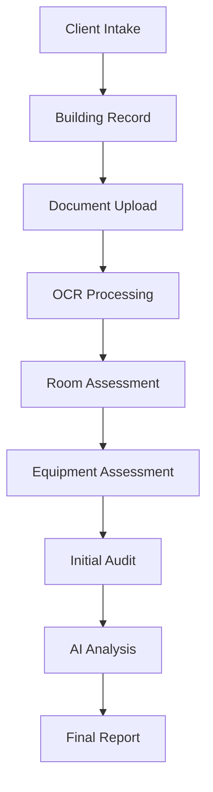
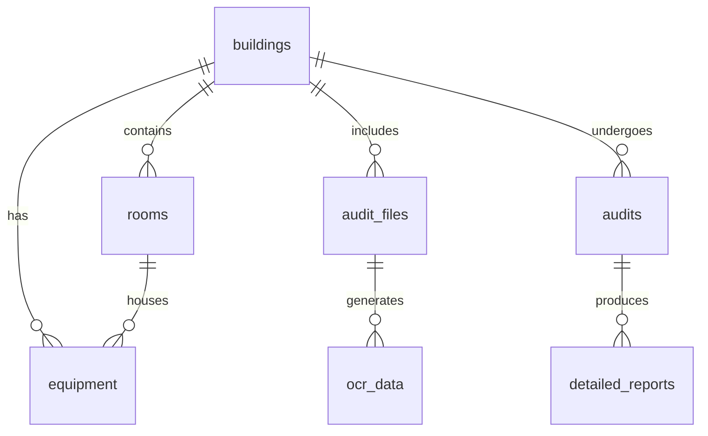

# Energy Audit Process Documentation

## Overview

The energy audit process follows a structured workflow from initial data collection through AI analysis to final report generation. This document details the complete process, database interactions, and internal workflows.

## Process Flow

### 1. Initial Data Collection

#### Client Intake Form
- Creates a new building record in `buildings` table
- Collects basic information:
  - Building name
  - Address
  - Type (residential/commercial/industrial)
  - Floor area
  - Construction year

```sql
buildings {
  id: uuid
  name: text
  address: text
  type: text
  area: numeric
  construction_year: integer
}
```

### 2. Document Processing

#### File Upload
1. Files are uploaded to Supabase storage bucket 'audit-files'
2. Entry created in `audit_files` table:
```sql
audit_files {
  id: uuid
  file_url: text
  file_name: text
  file_type: text
  building_id: uuid (foreign key)
  ocr_text: text
  processing_status: text
}
```

#### OCR Processing
1. Files processed through OCR
2. Results stored in `ocr_data` table:
```sql
ocr_data {
  id: uuid
  file_id: uuid (foreign key)
  raw_text: text
  processed_text: jsonb
  metadata: jsonb
}
```

### 3. Room Assessment

#### Room Data Collection
1. Rooms extracted from floor plans or manually entered
2. Stored in `rooms` table:
```sql
rooms {
  id: uuid
  building_id: uuid (foreign key)
  name: text
  area: numeric
  lighting_type: text
  num_fixtures: integer
  ac_type: text
  ac_size: numeric
  room_data: jsonb
}
```

### 4. Equipment Assessment

#### Equipment Data Collection
1. Equipment details entered manually or through AI detection
2. Stored in `equipment` table:
```sql
equipment {
  id: uuid
  building_id: uuid (foreign key)
  room_id: uuid (foreign key)
  type: text
  manufacturer: text
  capacity: text
  condition: text
  efficiency_rating: text
}
```

### 5. Audit Analysis

#### Initial Audit Creation
1. Creates record in `audits` table with findings:
```sql
audits {
  id: uuid
  building_id: uuid (foreign key)
  type: text
  status: text
  findings: jsonb
  recommendations: jsonb
}
```

#### AI Analysis Process
1. Findings data sent to DeepSeek for analysis
2. Analysis results stored in `detailed_reports` table:
```sql
detailed_reports {
  id: uuid
  audit_id: uuid (foreign key)
  content: jsonb
  generated_at: timestamptz
}
```

### 6. Report Generation

#### Report Components
1. Executive Summary
   - Annual savings potential
   - ROI percentage
   - Payback period
   - CO2 reduction

2. Energy Performance
   - Annual consumption
   - Peak demand
   - Carbon footprint
   - Energy cost

3. Recommendations
   - Title
   - Description
   - Savings potential
   - Implementation cost
   - ROI
   - Priority level

## Data Flow



## Database Relationships



## Security

### Row Level Security (RLS)
- All tables have RLS enabled
- Policies ensure users can only access their own data
- Anonymous access allowed for initial data collection
- Authenticated access required for sensitive operations

### Storage Security
- Audit files stored in dedicated bucket
- Access controlled through RLS policies
- Public URLs generated for sharing reports

## Error Handling

1. File Processing
   - Maximum file size: 10MB
   - Supported formats: PDF, JPEG, PNG
   - OCR failures logged and reported

2. Data Validation
   - Required fields enforced at database level
   - Input sanitization on all user inputs
   - Numeric value constraints (e.g., positive areas)

3. AI Analysis
   - Response validation
   - Fallback to default values if analysis fails
   - Error logging and user notification

## Caching Strategy

1. OCR Results
   - Cached in `ocr_data` table
   - Reused for similar documents

2. AI Analysis
   - Cached in `detailed_reports` table
   - Invalidated when audit data changes

## Performance Considerations

1. Indexes
   - Created on frequently queried columns
   - Optimized for common search patterns

2. Batch Processing
   - Multiple files processed in parallel
   - Results aggregated before storage

3. Query Optimization
   - Joins minimized where possible
   - Selective column retrieval
   - Pagination for large datasets